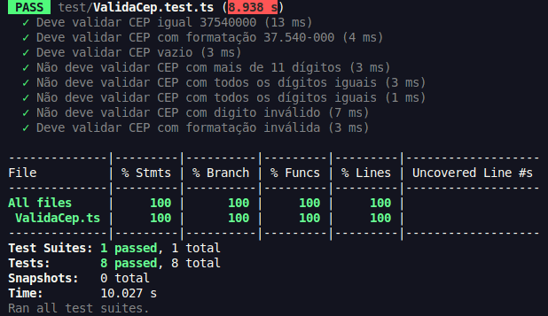
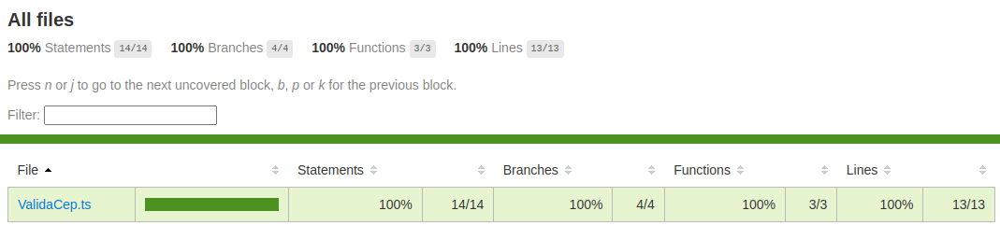

# Extra Content

Este projeto foi iniciado com o objetivo de reforçar os conhecimentos adquiridos durante o curso Clean Code e Clean Architecture do [Rodrigo Branas](https://github.com/rodrigobranas).


## Pré-requisitos

Antes de começar, certifique-se de ter o Node.js e o npm (ou yarn) instalados na sua máquina.

- [Node.js](https://nodejs.org/) - Versão mínima recomendada: 14.x
- [npm](https://www.npmjs.com/) ou [yarn](https://yarnpkg.com/)
- [jest](https://jestjs.io/) 29.7

## Instalação

1. Clone o repositório para sua máquina local:

```bash
    git clone git@github.com:renanramos/clean-code-clean-architecture.git
```

2. Navegue até o diretório do projeto:

```bash
    cd clean-code-clean-architecture/extra-content
```

3. Instale as dependências do projeto:

  - Se estiver usando npm:
  ```bash
    npm install -y
  ```

  - Se estiver usando yarn:
  ```bash
    yarn install
  ```

## Estrutura do projeto

A estrutura do projeto é a seguinte:
```
nome-do-projeto/
│
├── src/                # Contém todo o código da aplicação
│   └── ...
│
├── test/               # Contém os arquivos de testes
│   └── ...
│
├── package.json        # Configurações do projeto e dependências
└── ...

```

## Executando os Testes

O projeto utiliza Jest para execução de testes unitários.

```bash
npx jest --watch --collect-coverage
```

### CLI opcionais

`--watch`: Observa o arquivo e reexecuta todos os testes quando alguma alteração ocorre.

`--collect-coverage`: Indica que as informações de cobertura de testes devem ser coletados e registrados no diretório.

___

Ao final, será apresentado no console o resultado dos testes, conforme abaixo:


___

### Acessar página de cobertura

Ao final dos testes, todo o relatório de cobertura estará disponível dentro da pasta `coverage`. Abra o arquivo `index.html` no seu navegador de preferência:

